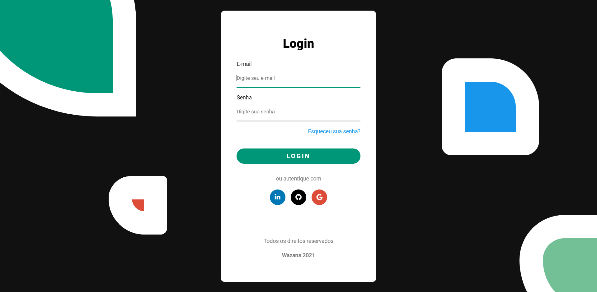

# Projeto Introdução ao CSS

  <a href="https://wazana.dev">
    
    <h1 align="center">wazana.dev</h1>
  </a>

  
  
  
  
  
  
  

**Playlist:** [CSS para Iniciantes](https://www.wazana.dev/playlist/css-para-iniciantes).

## Introdução
Projeto simples de uma página de login genérica e uma página de dashboard simples, para
o ensino da Introdução ao CSS.
  
#### Conceitos aplicados durante a playlist:
- Seletores;
- Propriedades básicas de todos os tipos;
- Unidades de medida;
- Positions;
- Pseudo Classes/Elements;
- Alguns tipos de display;
- Borders;
- Float;
- Cores;
- Combinators, etc.

### Nível
- [x] - Básico

## Preview

## Autor

**Lucas Fernando** 

## Agradecimentos
- Conteúdo feito para [wazana.dev](https://www.wazana.dev/) - Tecnologia direto ao ponto.
